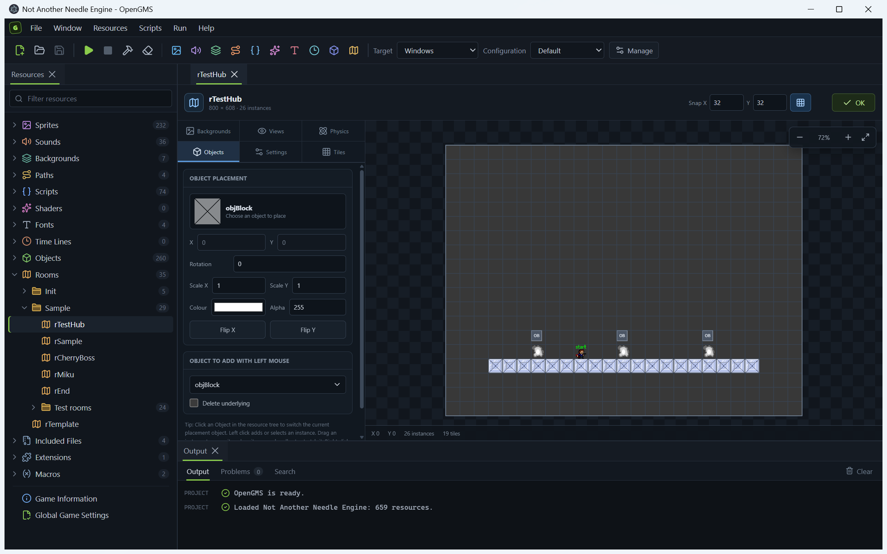

# OpenGMS

A modern Windows-focused editor for GameMaker Studio 1.4 `.project.gmx` projects.



OpenGMS provides a Dockview workspace, Monaco-powered GML editing, resource editors, and project build/run support. Fast compilation is powered by [gmx-rs](https://github.com/cubeww/gmx-rs).

## Development

```bash
npm install
npm run dev
```

Open a project directly:

```bash
npm run dev -- "C:\path\to\game.project.gmx"
```

The packaged application accepts the same argument:

```bash
OpenGMS.exe "C:\path\to\game.project.gmx"
```

## Commands

- `npm run typecheck` — check TypeScript.
- `npm run build` — create a production build in `out`.
- `npm run package` — create an unpacked Windows application in `release`.
- `npm run dist` — create a portable Windows x64 ZIP in `release`.

## Release

The package version is the release version. From a clean `main` branch, create and
push a version tag:

```bash
npm version patch
git push origin main --follow-tags
```

Use `minor` or `major` instead of `patch` when appropriate. Tags matching `v*`
trigger the GitHub release workflow, which publishes the portable ZIP together
with its SHA-256 checksum.
